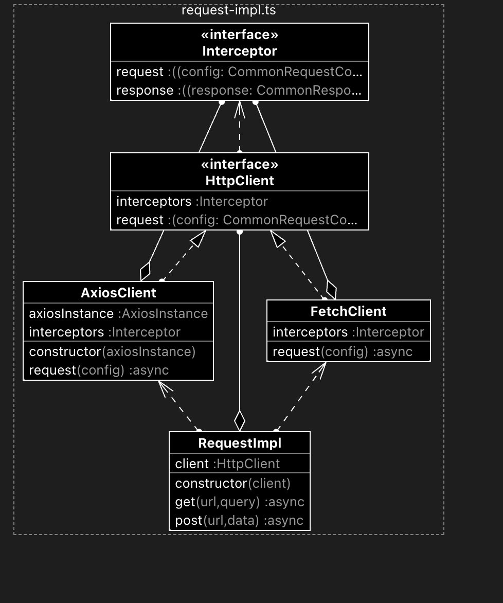

```bash
npm init -y
npx tsc --init
npm install -D typescript ts-node @types/axios
npm --registry=https://registry.npmjs.org login
npm --registry=https://registry.npmjs.org publish
npm install -D vitest
```

#### 封装请求基础库，兼容 fetch 和 axios

- `RequestImpl` 类的构造函数接收一个请求库实例 `HttpClient`；提供 get 与 post 实例方法，调用 client 实例的 request 方法发起请求

- `HttpClient` 具有 request 方法以及 `interceptors` 拦截器对象

  - interceptors 支持请求响应的拦截与处理

- `AxiosClient` 与 `FetchClient` 均满足 HttpClient 接口

  - 二者内部的逻辑区别在于 `request` 实例方法，对请求响应进行了统一配置与处理



#### TODO：基于发布订阅实现拦截事件监听与处理

#### TODO：github CI
